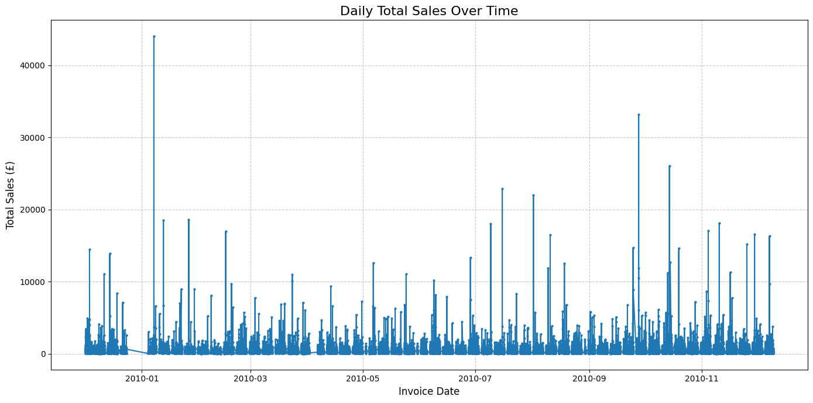
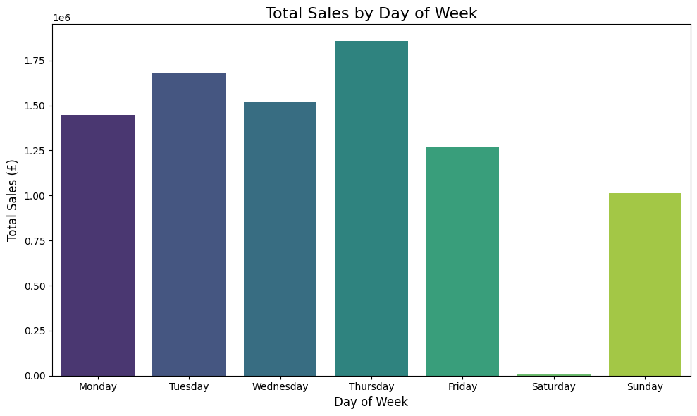
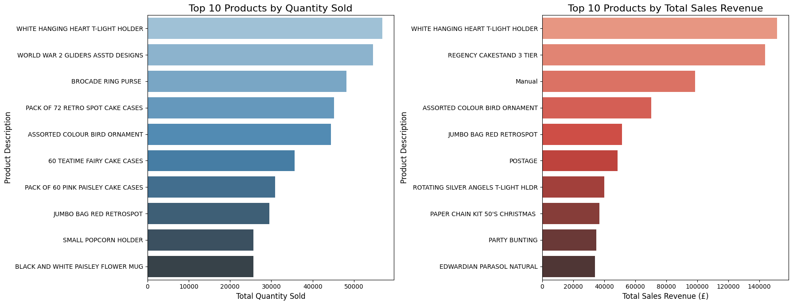
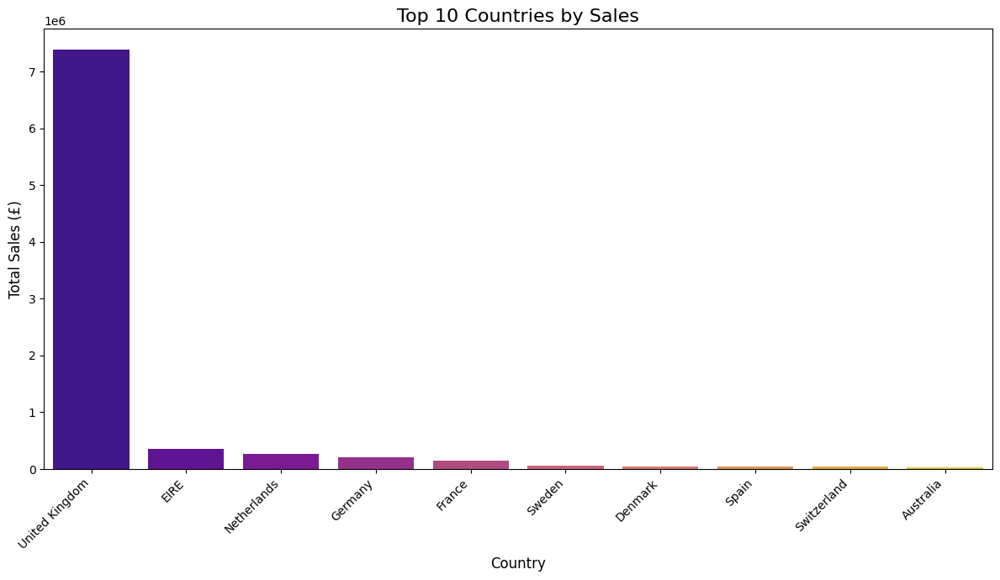
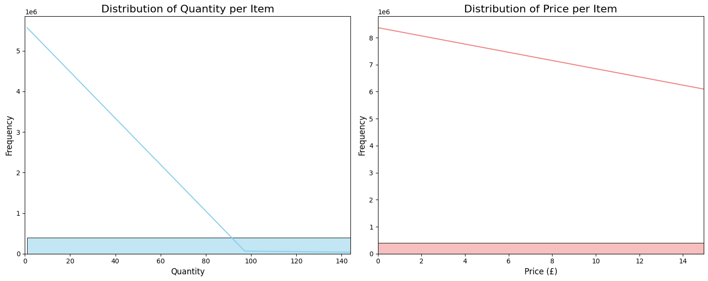
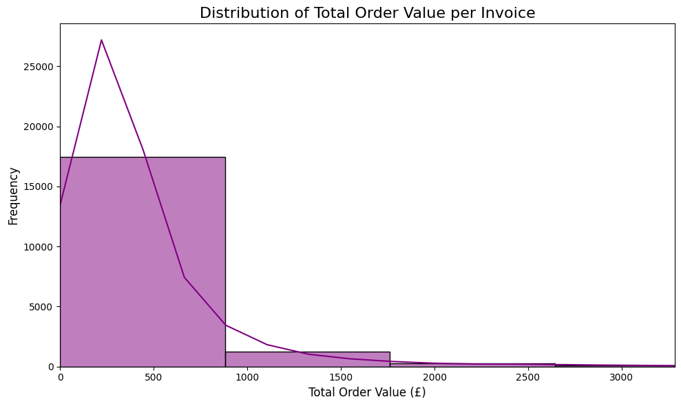
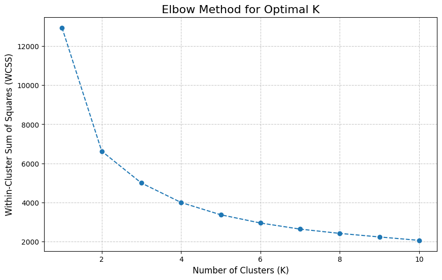
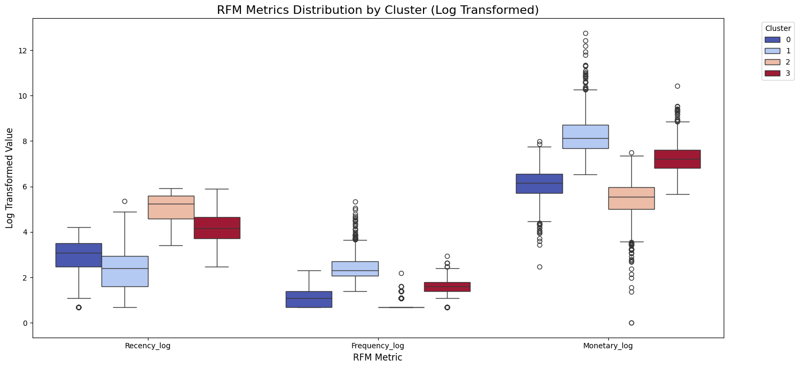

# E-Commerce-Customer-Segmentation
Customer segmentation for an online retail dataset using RFM analysis and K-Means clustering.

# --- Phase 1: Data Acquisition and Initial Understanding ---

# 1. Data Source Identification and Download
# Download the dataset using KaggleHub
# This assumes 'lakshmi25npathi/online-retail-dataset' is correctly configured in your Kaggle API.

# 2. Simulate SQL Initial Exploration (using Pandas)
# --- Phase 2: Data Cleaning and Preprocessing ---

# 1. Handle Missing Customer IDs
# 2. Handle Negative Quantities (typically returns, exclude for sales analysis)

# 3. Handle Negative Prices (likely data entry errors)

# 4. Remove Duplicate Rows

# 5. Create 'TotalPrice' Column

# --- Phase 3: Exploratory Data Analysis (EDA) & Visualization ---

# 1. Sales Trends Over Time
# Aggregate total price by InvoiceDate (daily sum)
### Overall Sales Trend
The daily sales plot shows significant fluctuations over time...

# Sales by Day of Week
# Reorder days for consistent plotting
### Sales by Day of Week
Sales are generally higher on Tuesdays and Thursdays...

# Sales by Hour of Day (extract hour from datetime)
### Sales by Hour of Day
Sales typically peak around midday (10 AM to 3 PM)...

# 2. Top N Products by Sales and Quantity
### Top Products
Products like 'WHITE HANGING HEART T-LIGHT HOLDER'...

# 3. Sales by Country

### Geographical Sales Distribution
The United Kingdom is by far the dominant market...

# 4. Distribution of Quantity and Price
### Distribution of Quantity and Price
Both 'Quantity' and 'Price' distributions are highly skewed...

# 5. Average Order Value
### Average Order Value
The distribution of total order values per invoice also shows skewness...

# Calculate total price for each unique invoice

# --- Phase 4: Machine Learning (Customer Segmentation) ---

# 1. Calculate RFM Values

# Recency: Days since last purchase
# Frequency: Number of unique invoices

# Monetary: Total spend

# Merge all RFM features

# 2. Handle Skewness (Log Transformation)
# Apply log1p (log(1+x)) to handle potential zero values gracefully
# Plot histograms of transformed RFM features
To handle skewness, RFM features were log-transformed...
.png)

# 3. Feature Scaling

# 4. Determine Optimal Number of Clusters (Elbow Method)
The elbow method suggested 4 optimal clusters...

# Based on the elbow plot, k=4 seems to be a good choice where the curve starts to flatten.
# 5. Apply K-Means Clustering
# 6. Analyze Cluster Characteristics (using original RFM values for interpretability)
# Sort clusters for easier comparison if needed (e.g., by Monetary value)
# Visualizing cluster characteristics
The final clusters show distinct RFM profiles, visualized here with box plots...

# Adjusting Value limits for better visualization due to high monetary values for some clusters
# Use log-transformed values for visualization if the original values are too skewed for clear plots
# --- Phase 5: Interpretation and Reporting ---

# 1. Summarize Key EDA Insights
eda_summary = """
Key Exploratory Data Analysis (EDA) Insights:
------------------------------------------
1.  Overall Sales Trend: The daily sales plot shows significant fluctuations over time, with clear periods of higher and lower activity. Further time series decomposition would be needed to precisely identify underlying trend and seasonality. Sales are generally higher on Tuesdays and Thursdays, and peak around midday (10 AM to 3 PM).
2.  Geographical Sales Distribution: The United Kingdom is by far the dominant market, accounting for the vast majority of total sales revenue. EIRE, Netherlands, Germany, and France follow, but their contributions are substantially smaller, indicating a highly concentrated market.
3.  Top Products: Products like 'WHITE HANGING HEART T-LIGHT HOLDER', 'WORLD WAR 2 GLIDERS ASSTD DESIGNS', and 'BROCADE RING PURSE' are consistently top performers both in terms of quantity sold and total revenue generated. These are likely popular, potentially high-volume items.
4.  Distribution of Quantity and Price: Both 'Quantity' and 'Price' distributions are highly skewed to the lower end, meaning most transactions involve small quantities of relatively low-priced items. There's a long tail indicating a few very large or expensive purchases.
5.  Average Order Value: The distribution of total order values per invoice also shows skewness, with most transactions being of lower monetary value, and a smaller number of high-value orders. The average order value is around £X (refer to your specific average_order_value calculation).
"""

# 2. Detailed Customer Segment Characterization
customer_segments_description = """
Customer Segment Characterization (Based on RFM Analysis with 4 Clusters):
----------------------------------------------------------------------
(Note: Cluster IDs may vary based on K-Means initialization, but characteristics remain consistent)

Here, we'll map the actual cluster IDs from the 'cluster_analysis' DataFrame to descriptive names.
Let's assume the sorting by Monetary value places the 'Champions' first.

-   **Cluster 1: "Champions / Most Valuable Customers"**
    -   **Recency (Mean):** ~13.86 days (Very Low) - Purchased very recently.
    -   **Frequency (Mean):** ~14 (Very High) - Extremely frequent buyers.
    -   **Monetary (Mean):** ~£7369.38 (Very High) - Top revenue contributors.
    -   **Description:** These are the most loyal, active, and highest-spending customers. They are critical to the business's success.

-   **Cluster 3: "At-Risk Loyal Customers"**
      -   **Recency (Mean):** ~82.24 days (Medium to High) - Noticeable gap since last purchase.
    -   **Frequency (Mean):** ~4 (High) - Previously very active.
    -   **Monetary (Mean):** ~£1761.18 (High) - Significant past contributions.
    -   **Description:** Customers who were highly valuable but are showing signs of disengagement. They are at risk of churning if not re-engaged soon.

-   **Cluster 0: "Promising / Active Customers"**
      -   **Recency (Mean):** ~23.44 days (Low) - Relatively recent engagement.
    -   **Frequency (Mean):** ~2 (Moderate) - Consistent but not extremely frequent.
    -   **Monetary (Mean):** ~£550.48 (Moderate) - Contribute reasonably well.
    -   **Description:** Active customers with potential to grow into champions with proper nurturing. They might be newer or buy steadily.

-   **Cluster 2: "Churned / Lost Customers"**
   -   **Recency (Mean):** ~189.01 days (Very High) - Long time since last purchase.
    -   **Frequency (Mean):** ~1 (Very Low) - Infrequent buyers.
    -   **Monetary (Mean):** ~£301.23 (Very Low) - Minimal past spend.
    -   **Description:** Largely inactive customers who have likely churned. They represent low return on re-engagement efforts.

"""

# 3. Actionable Business Recommendations
business_recommendations = """
Actionable Business Recommendations:
----------------------------------
Based on our EDA and customer segmentation, here are strategic recommendations:

1.  **For "Champions" (Cluster with highest Monetary):**
    * **Retention & Reward:** Implement exclusive loyalty programs, early access to new products, VIP customer service, and personalized 'thank you' gestures. Focus on appreciation over discounts to maintain perceived value.
    * **Upselling/Cross-selling:** Offer premium product lines or complementary items based on their past purchases.
    * **Advocacy Programs:** Encourage referrals and testimonials, as they are likely to be strong brand advocates.

2.  **For "Promising / Active Customers" (Cluster with moderate Recency, Frequency, Monetary):**
    * **Nurturing & Growth:** Provide personalized product recommendations and curated content based on their buying patterns.
    * **Engagement:** Send targeted email campaigns with product updates, special offers, or relevant information to encourage repeat purchases.
    * **Seamless Experience:** Ensure consistent, quick, and positive customer service experiences to build stronger loyalty.

3.  **For "At-Risk Loyal Customers" (Cluster with higher Recency, but high past F & M):**
    * **Re-engagement Campaigns:** Implement personalized win-back strategies, such as "We miss you" emails with enticing, time-limited discounts or free shipping.
    * **Feedback Collection:** Proactively reach out to understand reasons for reduced activity.
    * **Highlight Value:** Remind them of the benefits and value they received from past purchases.

4.  **For "Churned / Lost Customers" (Cluster with very high Recency, low F & M):**
    * **Selective Re-acquisition:** For a very small, carefully identified sub-segment, extremely attractive offers might be tested, but generally, resource allocation should be minimal as ROI is low.
    * **Churn Prevention Analysis:** Analyze their characteristics to refine strategies for "At-Risk" customers and prevent future churn.
    * **Surveys:** Consider short, anonymous surveys to gather insights into reasons for complete churn.

5.  **General Business Recommendations (from EDA):**
    * **Geographical Strategy:** Continue to prioritize the UK market as the primary revenue driver. Explore localized marketing and logistics investments in secondary markets like EIRE, Netherlands, Germany, and France.
    * **Product Focus:** Ensure consistent stock and promotion of top-selling products. Explore bundling popular items to increase average order value.
    * **Inventory & Pricing:** The skewed distributions of quantity and price highlight the importance of robust inventory management for high-volume, low-cost items and careful pricing strategies for higher-value, lower-volume goods.
    * **Time-based Optimization:** Leverage insights from daily/hourly sales trends for staffing, marketing campaign timing, and product availability.
"""

# 4. Limitations and Future Work
limitations_future_work = """
Limitations and Future Work:
--------------------------
1.  **Data Scope:** This analysis primarily uses transactional data. Integrating customer demographic information (e.g., age, gender, precise location) or website Browse behavior would enable even richer segmentation and more personalized strategies.
2.  **Time Period:** The dataset covers a specific time frame. Incorporating a longer historical period would provide deeper insights into long-term customer behavior trends and seasonality.
3.  **Customer ID Gaps:** The exclusion of transactions without a Customer ID means we only analyzed a subset of all sales. Future work could investigate these anonymous transactions for overall revenue insights.
4.  **Clustering Algorithm:** While K-Means is effective, exploring other clustering algorithms (e.g., DBSCAN for density-based clusters or Hierarchical Clustering) might reveal alternative or more nuanced segmentations.
5.  **Predictive Modeling:** This project focuses on descriptive and segmentation analysis. Future work could involve building predictive models such as:
    * **Customer Lifetime Value (CLTV) Prediction:** To forecast the future revenue contribution of each customer.
    * **Churn Prediction:** To proactively identify customers at high risk of churning before they become 'At-Risk'.
    * **Recommendation Systems:** To provide highly personalized product suggestions, enhancing customer experience and driving sales.
    * **Time Series Forecasting:** To accurately predict future sales volumes or demand for specific products.
"""
